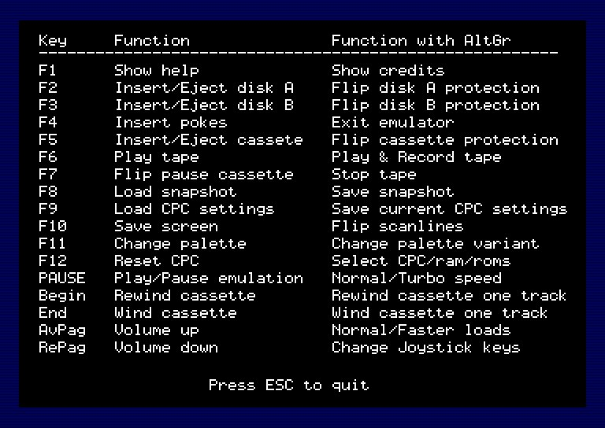
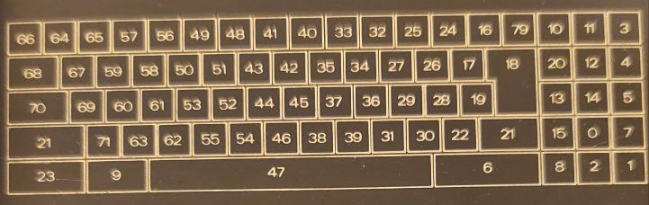
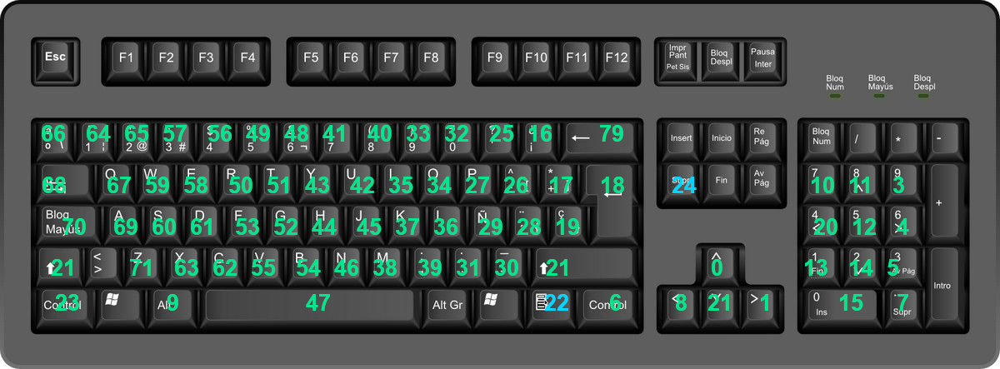

An unfinished Amstrad CPC 464/664/6128 emulator.
It is intended that it can be ported to the Lilygo board (credit card size more or less) with VGA output, PS2 inputs and microSD slot, that's why the user interface overwrites the emulator screen.


# Dependencies
- SDL2
- SDL2_image


# Linux version
<br>You need to have these packages installed:
- sdl2
- sdl2-image

I type ```sudo apt install sdl2 sdl2-image``` in Linux Mint.


# Instructions
You can get help pressing F1, then you'll get this help

<br>(Options about sound are not available)
<br>In other windows, help with the keys and function will appear in a bottom bar.


## Joystick
You can simulate the joystick pressing AltGr+RePag and there are 4 modes:  (Directions, fire 1, fire 2)
- QAOP, Space bar, Alt
- Cursor keys, Space bar, Alt
- Keypad 8246, Keypad 0, Keypad dot
- Joystick is not simulated


## Normal/Faster loads
When it is in faster mode:
- the pause blocks on tapes will be reduced to 100 mseg
- FDC is always ready to read and write


# Keyboard
The CPC keyboard layout on a PC keyboard is based on that of the CPC6128 and both are very similar, only two keys change location.

<br>
CPC6128 keyboard codes.

<br>
PC keyboard with key mappings. Only two keys have been moved.


# TO DO:
- CRTC!!
- PSG, AY and sound
- Z80: tune cycle timing
- FDC: 
	- tune time responses
	- read track function.
		Discology reads tracks as a big sector, then it reads bytes between sectors data, and 
		I have no documentation to simulate that.
	- test disks for ParaDOS
- TAPE: 
	- test blocks
- OSD: show local characters


# KNOWN BUGS
- TAPE:
	- some games, when the load is finish, they don't start

